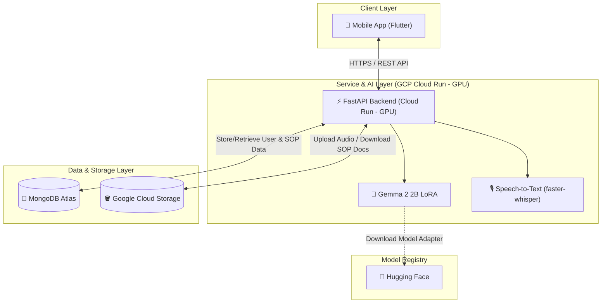

<!--
file: README.md
-> Menjelaskan project workspace SOP-ify
-> Menyediakan arsitektur sistem, tim project plan, dan dokumentasi sub-proyek
-->

# SOP-ify - Capstone-Project-PJK-GM069
---------------

 Hello folks! we are PJK-GM069! 

 This is our final project for Pijak x IBM SkillsBuild 

  

    <a href="[PLACEHOLDER_FIGMA_UI_UX_LINK]">UI/UX Design</a> &middot;
    <a href="[PLACEHOLDER_APK_DOWNLOAD_LINK]">APK Download</a> &middot;
    <a href="[PLACEHOLDER_PRESENTATION_SLIDE_LINK]">Presentation Slide</a> 

<!-- [PLACEHOLDER_DEMO_VIDEO_LINK] -->

#### about

Our project, SOP-ify, is a mobile application designed to assist Indonesian MSMEs (UMKM) in automatically creating structured Standard Operating Procedures (SOPs). By typing or recording a voice note of their business procedures, the system utilizes AI to translate casual and unstructured language into professional, step-by-step SOP documents.

### Architecture Diagram

Below is the system architecture showing how the Flutter mobile application, FastAPI backend, databases, and AI components interact:

### Documentation
You can find our relevant documentation at the following links:
- [Machine Learning Documentation](https://github.com/SOP-ify/ML)
- [Backend Documentation](https://github.com/SOP-ify/backend-api)
- [Mobile Apps Documentation](https://github.com/SOP-ify/mobile-sopify)

# The Gang

| Name | Role | id |
| ------------------------------- | ---------------------------------------------------------------------------------------------------------------------------------------------------------------------------------------- | ------- |
| Titasari Pratiwi | Cloud Computing | APC277D6X0010 |
| Muhammad Favian Jiwani | Mobile Development | APC237D6Y0191 |
| Akmal Maulana | Cloud Computing | APC367D6Y0196 |
| Muhamad Iqbal Reza | Machine Learning | APC237D6Y0417 |
| Suryani | UI/UX Design | APC367D6X0436 |
